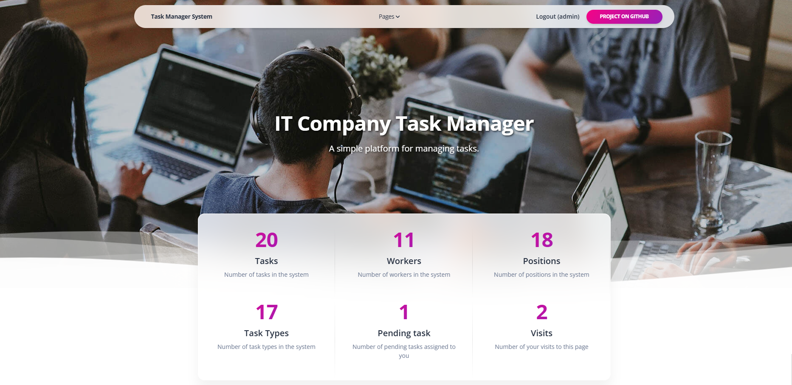

# IT Company Task Manager

A **Django-powered web application** designed to simplify task management processes in IT companies.

## Live Demo

The application is deployed and available at: [https://it-company-task-manager-fdy0.onrender.com](https://it-company-task-manager-fdy0.onrender.com)

You can test the application using these demo credentials:
- **Login:** admin
- **Password:** 1111

## Features

* **Task Management:** Create, edit, delete, and prioritize tasks through an intuitive web interface
* **Status Tracking:** Monitor task statuses (e.g., **_Pending_**, **_Completed_**)
* **Authentication:** Comprehensive login and registration system for workers
* **Admin Panel:** Powerful administrative interface for advanced management
* **Email Verification:** Secure account activation via email confirmation
* **Localization Support:** Multi-language interface with Ukrainian and English support

## System Requirements

* **Python:** 3.11 or newer.
* **Operating System:** Compatible with Linux, macOS, and Windows.

## Environment Variables

The project requires the following environment variables in a `.env` file in the root directory.
* Create a `.env` file following the `.env.sample` template and replace with your values.
* Ensure that the `.env` file is not included in your version control system (e.g., Git) as it contains sensitive information.

## Getting started

Follow these steps to set up and run the project locally:

1. Clone the repository:
    ```shell
    git clone https://github.com/vladyslav-tmf/it-company-task-manager.git
    cd it-company-task-manager
    ```

2. Create and activate a virtual environment:
    - Linux/Mac:
      ```shell
      python3 -m venv venv
      source venv/bin/activate
      ```
    - Windows:
      ```shell
      python -m venv venv
      venv\Scripts\activate
      ```

3. Install dependencies:
    ```shell
    pip install -r requirements.txt
    ```

4. Apply database migrations:
    ```shell
    python manage.py migrate
    ```

5. Load sample data (optional):
    ```shell
    python manage.py loaddata dataset.json
    ```

6. Compile translation files:
    ```shell
    python manage.py compilemessages -i "venv*"
    ```

7. Start the development server:
    ```shell
    python manage.py runserver
    ```

8. Access the application at: [http://127.0.0.1:8000](http://127.0.0.1:8000)

## Demo

Preview of the application interface:



## Testing

To run the automated tests:
```shell
python manage.py test
```

## Additional Resources

The front-end of this project utilizes a Bootstrap template.

- **Template Name**: Soft UI Design System
- **Author**: © Creative Tim - Coded by AppSeed
- **Source**: [Link to Official Website](https://app-generator.dev/product/soft-ui-dashboard/django/)
- **License**: [View License](https://www.creative-tim.com/license)

This template provides the base styling and layout, customized to fit the needs of this project.
